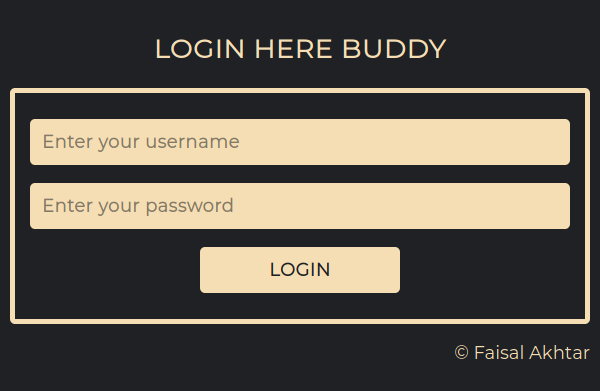
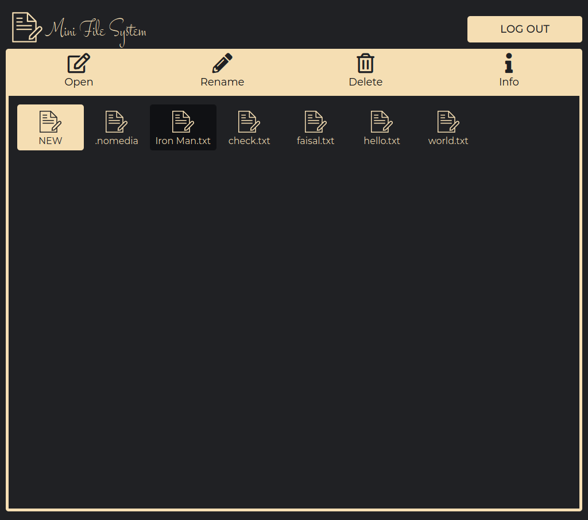
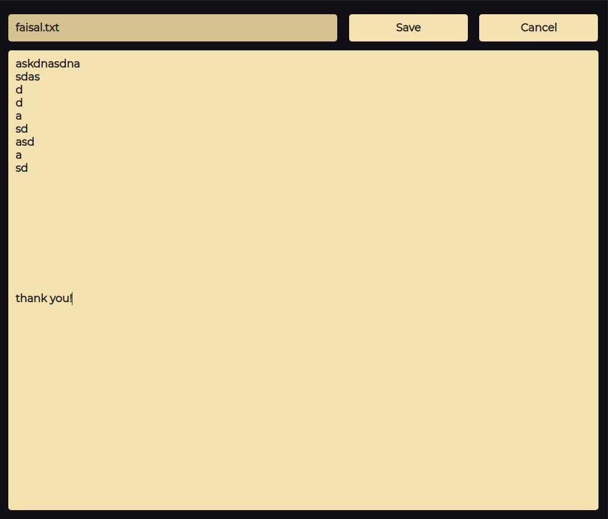
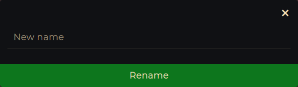
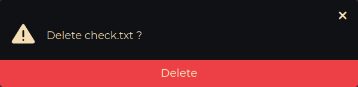

# Mini File Management System

A fully responsive, cross-browser functional file management system with basic functionalities to create, edit, rename and delete a file and view a it's information in a discretely allocated space for each user.


&nbsp;


<p align="center"></p>


## Installation
### Clone
### Setup


## Deployment


## Features
<table>
  <tr>
    <td colspan="2">
      <h3 align="center">Discrete sign-in</h3>
      <p align="center"></p>
    </td>
  </tr>

  <tr>
    <td>
      <h3 align="center">Personal file-space allocated</h3>
      <p align="center"></p>
    </td>
    <td>
      <h3 align="center">File Editor</h3>
      <p align="center"></p>
    </td>
  </tr>

  <tr>
    <td>
      <h3 align="center">Renaming files</h3>
      <p align="center"></p>
    </td>
    <td>
      <h3 align="center">Deleting files</h3>
      <p align="center"></p>
    </td>
  </tr>
</table>


## Built with

&emsp;&emsp;&emsp;&emsp;&emsp;&emsp;


## Contributing
### Step 1
- Option 1
  - :fork_and_knife: Fork this repository
- Option 2
  -  :dancers: Clone this repo to your local machine using ```git clone https://github.com/faisalakhtar/mini-file-system.git```

### Step 2
- **HACK AWAY** :hammer: :hammer: :hammer:

### Step 3
- :repeat: Create a pull request using https://github.com/faisalakhtar/mini-file-system/compare/


## Contributors

<table>
  <tr>
    <td align="center">
      <a href="http://faisalakhtar.github.io">
        
      </a>
    </td>
  </tr>
  <tr>
    <td align="center">
      <a href="http://faisalakhtar.github.io">
        github/faisalakhtar
      </a>
    </td>
  </tr>
  <tr>
    <td align="center">
      <a title="Code">💻</a>
      <a title="Design">🎨</a>
      <a title="Documentation">📖</a>
      <a title="Maintenance">🚧</a>
    </td>
  </tr>
</table>

## Licensing


All scripts, stylesheets and markups are distributed under the [MIT](LICENSE) license.

## Acknowledgements

- File management and handling was inspired from [Linux file systems](https://www.linux.org/).

- Some icons in this READme were borrowed from [here](https://commons.wikimedia.org/wiki/Main_Page)
