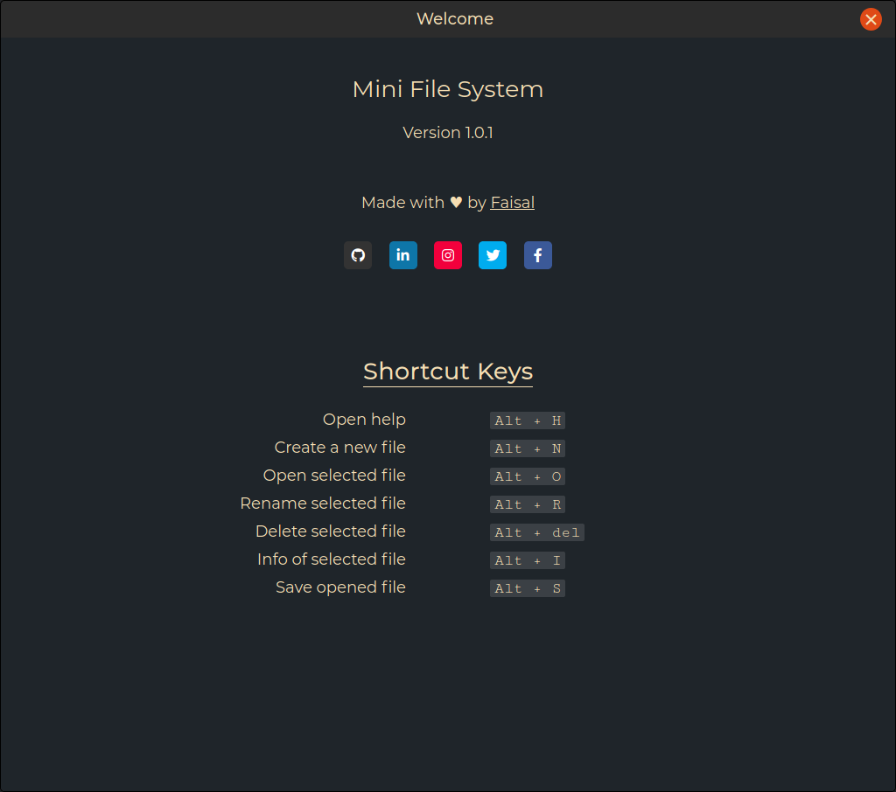

# Mini File Management System

A fully responsive, cross-browser functional file management system with basic [functionalities](#features) to [create](#file-editor), [edit](#file-editor), [rename](#renaming-files) or [delete](#deleting-files) a file and [view it's information](#file-information) in a [discretely](#sign-in) allocated [space](#personal-file-space-allocated) for the user.


&nbsp;


<p align="center"></p>


## Table of content
| SNo | Content                               |
|-----|---------------------------------------|
|  1  | [Installation](#installation)         |
|     | [Requirements](#requirements)         |
|     | [Clone](#clone)                       |
|     | [Setup](#setup)                       |
|  2  | [Features](#features)                 |
|  3  | [Built with](#built-with)             |
|  4  | [Contributing](#contributing)         |
|  5  | [LICENSE](#licensing)                 |
|  6  | [Acknowledgements](#acknowledgements) |


## Installation

### Requirements
[Express ](https://npmjs.org/package/express)
&emsp;
[CORS ](https://npmjs.org/package/cors)

### Clone
- Clone this repo to your local machine using `git clone https://github.com/faisalAkhtar/mini-file-system`

### Setup
- Use `npm install` to install the dependencies first
- Then start using `node app.js`

### Nodemon
- It's better to use `nodemon` if you want to make some changes in this app.
- You can install it using `npm install -g nodemon` [this will install it globally into your PC]
- And then running it as `nodemon app.js`
- For more info follow [this link](https://www.npmjs.com/package/nodemon)


## Features
<table>
  <tr>
    <td colspan="2">
      <p align="center"></p>
    </td>
  </tr>

  <tr>
    <td>
      <h3 align="center">Personal file-space allocated</h3>
      <p align="center"></p>
    </td>
    <td>
      <h3 align="center">File Editor</h3>
      <p align="center"></p>
    </td>
  </tr>

  <tr>
    <td>
      <h3 align="center">Sign-in</h3>
      <p align="center"></p>
    </td>
    <td>
      <h3 align="center">File Information</h3>
      <p align="center"></p>
    </td>
  </tr>

  <tr>
    <td>
      <h3 align="center">Deleting files</h3>
      <p align="center"></p>
    </td>
    <td>
      <h3 align="center">Renaming files</h3>
      <p align="center"></p>
    </td>
  </tr>
</table>


## Built with

&emsp;&emsp;&emsp;&emsp;&emsp;&emsp;&emsp;


## Contributing
### Step 1
- Option 1
  - :fork_and_knife: Fork this repository
- Option 2
  -  :dancers: Clone this repo to your local machine using ```git clone https://github.com/faisalakhtar/mini-file-system.git```

### Step 2
- **HACK AWAY** :hammer: :hammer: :hammer:

### Step 3
- :repeat: Create a pull request using https://github.com/faisalakhtar/mini-file-system/compare/


## Licensing


All scripts, stylesheets and markups are distributed under the [MIT](LICENSE) license.

## Acknowledgements

- File management and handling was inspired from [Linux file systems](https://www.linux.org/).

- Some icons in this READme were borrowed from [here](https://commons.wikimedia.org/wiki/Main_Page)

- CORS icon was taken from [mozilla](https://mozilla.org/) and is licensed under [Creative Commons Attribution Share-Alike License v3.0](https://creativecommons.org/licenses/by-sa/3.0/)
